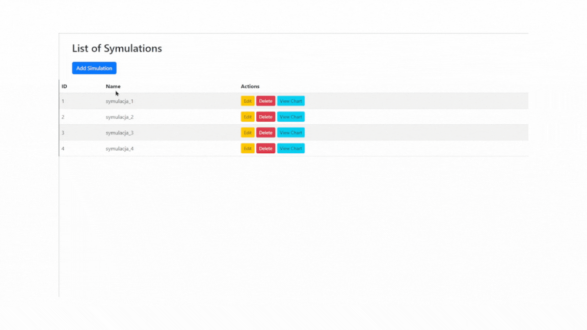

# Simulation Development Epidemic

## License

This project is licensed under the MIT License. See the LICENSE file for details.

## Table of Contents

- [About](#about)
- [Features](#features)
- [Demo](#demo)
- [Installation](#installation)
  - [Backend](#backend)
  - [Frontend](#frontend)
- [Usage](#usage)
- [API Endpoints](#api-endpoints)
- [Contributing](#contributing)
- [License](#license)

## About

Simulation Development Epidemic is a web application designed to manage and visualize epidemic simulations. It provides functionality to create, view, update, and delete simulations, as well as visualize the simulation data through charts.

## Features

- Create, view, edit, and delete epidemic simulations
- Visualize simulation data with charts
- Responsive design using Bootstrap

## Demo



## Installation

### Backend

1. Clone the repository:
   ```bash
   git clone https://github.com/yourusername/simulation-development-epidemic.git

2. Navigate to the backend directory:
   ```bash
   cd simulation-development-epidemic/backend

3. Install backend dependencies:
   ```bash
   ./mvnw clean install

4. Run the backend server:
   ```bash
   ./mvnw spring-boot:run

   The backend server will start on port 8080.

### Frontend

1. Navigate to the frontend directory:
   ```bash
   cd simulation-development-epidemic/frontend

2. Install frontend dependencies:
    ```bash
    npm install

3. Start the frontend development server:
    ```bash
    ng serve

   The frontend application will be available at http://localhost:4200.

## Usage

- Open your browser and navigate to http://localhost:4200 to view the application.
- Use the interface to add, edit, or delete simulations.
- View charts to analyze the simulation data.

## API Endpoints

### Population
    
    - GET /getPopulationData/{id}
      Retrieves population data for a specific simulation ID.
      Parameters:
      - id (int): ID of the simulation

### Symulation
    
    - GET /getSymulations
      Retrieves a list of all simulations.
    
    - GET /getSymulation/{id}
      Retrieves details of a specific simulation by ID.
      Parameters:
      - id (int): ID of the simulation
    
    - POST /saveSymulation
      Creates a new simulation.
      Request Body:
      {
        "n": "string",
        "p": 0,
        "i": 0,
        "r": 0,
        "m": 0,
        "ti": 0,
        "tm": 0,
        "ts": 0
      }
```bash
- PUT /updateSymulation/{id}
  Updates an existing simulation by ID.
  Parameters:
  - id (int): ID of the simulation
  Request Body:
  {
    "n": "string",
    "p": 0,
    "i": 0,
    "r": 0,
    "m": 0,
    "ti": 0,
    "tm": 0,
    "ts": 0
  }
```bash
- DELETE /deleteSymulation/{id}
  Deletes a simulation by ID.
  Parameters:
  - id (int): ID of the simulation

## Contributing

Contributions are welcome! Please follow these steps to contribute:

1. Fork the repository on GitHub.
2. Create a feature branch:
   git checkout -b feature/YourFeature
3. Commit your changes:
   git commit -m 'Add some feature'
4. Push to the branch:
   git push origin feature/YourFeature
5. Open a pull request on GitHub.

## License

This project is licensed under the MIT License. See the LICENSE file for details.
